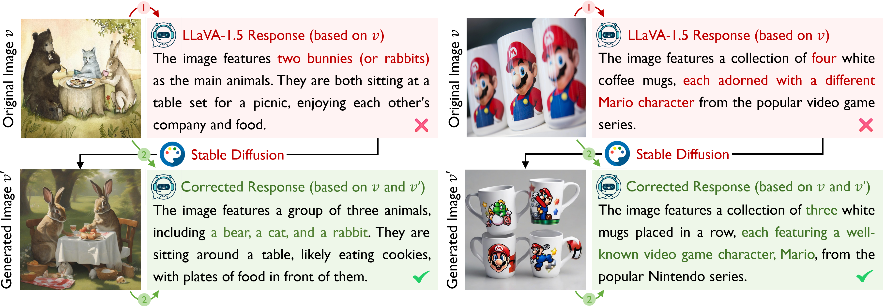
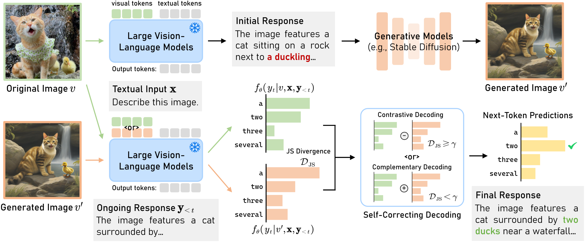

# [ICLR 2025] DeGF

[](https://zhangce01.github.io/DPE-CLIP/) [](http://arxiv.org/abs/2410.12790) [](https://iclr.cc/) [](https://opensource.org/licenses/MIT)

## 👀Introduction

This repository contains the code for our ICLR 2025 paper `Self-Correcting Decoding with Generative Feedback for Mitigating Hallucinations in Large Vision-Language Models`. 





## 💡Environment

We test our codebase with PyTorch 2.0.1. Please install corresponding PyTorch and CUDA versions according to your computational resources.

```
conda create -n DeGF python=3.10
conda activate DeGF
git clone https://github.com/zhangce01/DeGF.git
cd DeGF
pip install -r requirements.txt
```

Please also download the model checkpoints:

- [**LLaVA-1.5**](https://github.com/haotian-liu/LLaVA): Download [LLaVA-1.5 merged 7B](https://huggingface.co/liuhaotian/llava-v1.5-7b)
- [**InstructBLIP**](https://github.com/salesforce/LAVIS/tree/main/projects/instructblip): Download [InstructBLIP](https://huggingface.co/Salesforce/instructblip-vicuna-7b)

As for the datasets and benchmarks:

- For **MSCOCO** dataset, see [this link](https://cocodataset.org/).
- For **MME**, see [this link](https://github.com/BradyFU/Awesome-Multimodal-Large-Language-Models/tree/Evaluation).

## 📦Usage

We provide the code for evaluating our DeGF on POPE, CHAIR, and MME-Hallucination benchmark. You can simply run the following code to run the experiments:

- POPE: `bash eval_bench/scripts/pope_eval.sh`
- CHAIR:`bash eval_bench/scripts/chair_eval.sh`
- MME:`bash experiments/cd_scripts/mme_eval.sh`

## 🙏Acknowledgements

Our codebase is adapted from  [RITUAL](https://github.com/sangminwoo/RITUAL), [VCD](https://github.com/DAMO-NLP-SG/VCD), [OPERA](https://github.com/shikiw/OPERA), and [LLaVA](https://github.com/haotian-liu/LLaVA). We thank the authors for releasing their code!

## 📧Contact

If you have any questions, please  contact at [cezhang@cs.cmu.edu](mailto:cezhang@cs.cmu.edu).

## 📌 BibTeX & Citation

If you find this code useful, please consider citing our work:

```bibtex
@inproceedings{zhang2025selfcorrecting,
  title={Self-Correcting Decoding with Generative Feedback for Mitigating Hallucinations in Large Vision-Language Models},
  author={Ce Zhang and Zifu Wan and Zhehan Kan and Martin Q. Ma and Simon Stepputtis and Deva Ramanan and Russ Salakhutdinov and Louis-Philippe Morency and Katia P. Sycara and Yaqi Xie},
  booktitle={The Thirteenth International Conference on Learning Representations},
  year={2025},
  url={https://openreview.net/forum?id=tTBXePRKSx}
}
```

